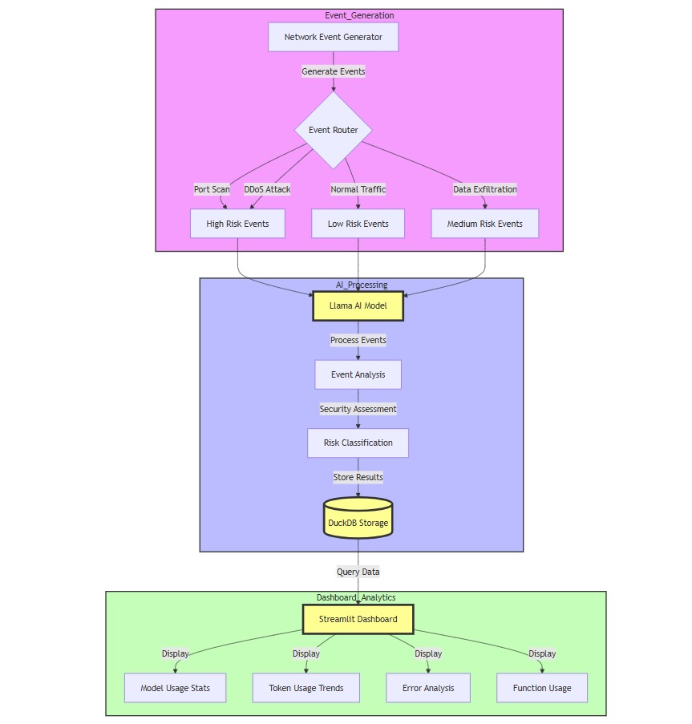

# How And Why Do AI Observability


## TL;DR

Built a complete system that watches your network traffic, uses AI to analyze threats in real-time, and shows everything in a clean dashboard. Perfect for seeing how AI performs in your industrial network and catching issues before they become problems.

Full Article : [https://medium.com/@learn-simplified/how-and-why-do-ai-observability-in-industrial-networking-392487d04df7


## Introduction
Picture walking into a modern factory where machines hum with activity. Now imagine having an AI system that watches every digital conversation between these machines, analyzing each data packet for potential threats. That’s exactly what I built — a system that not only monitors industrial network traffic but uses AI to make sense of it all in real-time.

## What's This Project About

The article dives into a practical system that combines three powerful components: a network event simulator that generates realistic industrial traffic patterns, an AI engine powered by the Llama model that analyzes these events for security threats, and a comprehensive dashboard that visualizes everything from model performance to token usage. The code shows how to build each piece, from generating synthetic network events to displaying real-time analytics. Every component is designed to work together, creating a complete observability solution that helps understand both network security and AI performance.

## Why Work on It?

In today’s industrial landscape, networking isn’t just about connectivity — it’s about security and intelligence. Through a fictional but practical implementation, this article demonstrates how to harness AI for network monitoring. The system handles everything from detecting potential DDoS attacks to analyzing traffic patterns, while also tracking the AI’s performance and resource usage. The dashboard provides immediate visibility into both network events and AI operations, making it invaluable for both IT teams and business stakeholders.

## Architecture


# AI Agents Architecture Flow Explanation

Starting with the Event Generation layer, designed it to handle different types of network traffic in a structured way. The Network Event Generator creates synthetic events that mirror real industrial network patterns — this gives us controlled test data without needing actual production traffic. Added a smart Event Router that automatically categorizes traffic based on risk levels because quick risk assessment is crucial in network security.

Made the risk classification branch into three clear paths:

High Risk: Port scans and DDoS attacks go here because they’re immediate threats
Medium Risk: Data exfiltration events need careful monitoring but aren’t always malicious
Low Risk: Normal traffic flows through here for baseline monitoring

For the AI Processing layer, integrated the Llama AI model as the brain of the system. The model takes all these categorized events and performs deep analysis. Built the Event Analysis component to process the AI’s insights and refine the risk classifications. Added DuckDB as the central storage because it handles time-series data efficiently and connects smoothly with our visualization layer.

In the Dashboard Analytics section, crafted a Streamlit dashboard that pulls data from DuckDB and presents it through four key views:

Model Usage Stats: Track how the AI model performs
Token Usage Trends: Monitor resource consumption
Error Analysis: Spot potential issues quickly
Function Usage: See which features get used most

Connected everything with direct data flows to minimize latency. The design ensures that when a network event occurs, it flows through the entire system — from detection to analysis to visualization — in near real-time. Placed DuckDB at the center of the architecture because it acts as the single source of truth for both real-time analysis and historical trending.


# Tutorial: How And Why Do AI Observability In Industrial Networking

## Prerequisites
- Python installed on your system.
- A basic understanding of virtual environments and command-line tools.

## Steps

1. **Virtual Environment Setup:**
   - Create a dedicated virtual environment for our project:
   
     ```bash
     python -m venv How-And-Why-Do-AI-Observability
     ```
   - Activate the environment:
   
     - Windows:
       ```bash
       How-And-Why-Do-AI-Observability\Scripts\activate       
       ```
     - Unix/macOS:
       ```bash
       source How-And-Why-Do-AI-Observability/bin/activate
       ```
   
# Installation and Setup Guide

**Install Project Dependencies:**

Follow these steps to set up and run the  "How And Why Do AI Observability In Industrial Networking"

1. Navigate to your project directory:
   ```
   cd path/to/your/project
   ```
   This ensures you're in the correct location for the subsequent steps.

2. Install the required dependencies:
   ```
   pip install -r requirements.txt   
   
   https://github.com/duckdb/duckdb/releases/download/v1.1.3/duckdb_cli-windows-amd64.zip
   ```
   This command installs all the necessary Python packages listed in the requirements.txt file.


## Run - Hands-On Guide: How And Why Do AI Observability In Industrial Networking

   ```bash 
     
      # set OPEN API KEY as DUMMY as we using Ollama
      set OPENAI_API_KEY = "ollama"
      # Run 
      streamlit run app.py   
      
      (How-And-Why-Do-AI-Observability) ~\How-And-Why-Do-AI-Observability.git>~\duckdb_cli-windows-amd64\duckdb.exe store.db
        v1.1.3 19864453f7
        Enter ".help" for usage hints.
        D      
                  
   ```

## Conclusion and Next Steps

Congratulations! You've just Built - How And Why Do AI Observability In Industrial Networking Project


